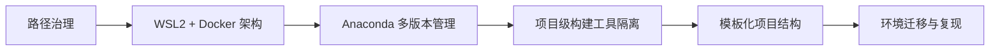

# Python 多版本环境治理 · 三维治理 / 四级隔离 / 五项自治

> 📌 基于 Windows 平台，构建统一路径、多版本隔离、工具封装、项目迁移的 Python 开发治理体系  
> 💡 详细理念请见原文博文：  
> https://aicity.blog.csdn.net/article/details/149055334

---

## 一、理念浓缩

### 1. 三维治理（治理维度）

- **路径治理**：统一磁盘/路径结构，避免系统盘污染，确保环境隔离  
- **构建治理**：构建工具（如 poetry/hatch/uv）随项目安装，避免全局污染  
- **调度治理**：协调 WSL → Docker → Conda → `.venv` 各层角色与职责

### 2. 四级隔离（治理结构）

1. **系统层** — Windows 操作系统 + 路径目录规划  
2. **虚拟层** — WSL2 子系统单独存储与环境隔离  
3. **容器层** — Docker 镜像与卷独立管理  
4. **Python 层** — Anaconda 多版本 + 项目级 `.venv` 虚拟环境

### 3. 五项自治原则（治理手段）

- **路径独立**：环境、数据、工具分区存放，不污染系统盘  
- **版本封装**：Python 环境、构建工具与 Docker 镜像都自动锁定版本  
- **工具随项目**：构建工具 (`poetry`, `uv`, `hatch`) 安装在 `.venv` 中  
- **权限最小**：整个流程尽量无需管理员权限  
- **可迁移复现**：支持环境导出/导入、容器迁移、WSL 快照

---

## 二、项目结构

```
python-env-governance/
├── .gitignore
├── LICENSE
├── README.md
├── docs/
│   ├── 01-理念概述.md
│   ├── 02-路径结构规范.md
│   ├── 03-Anaconda多版本策略.md
│   ├── 04-工具链隔离.md
│   └── 05-模板与迁移复现.md
└── tools/
    └── export_conda_envs.ps1
```

---

## 三、用法指南（Quick Start）

1. ✅ 克隆仓库

```bash
git clone https://github.com/<你的用户名>/python-env-governance.git
cd python-env-governance
```

2. 📚 阅读文档

任一 Markdown 编辑器打开对应章节查看内容：

```bash
code docs/01-理念概述.md
```

3. 🔧 运行脚本示例

导出当前用户所有 Conda 环境路径：

```powershell
.\tools\export_conda_envs.ps1
```

---

## 四、文档导航

| 编号 | 内容主题 | 文件名称 |
|:--:|----------|-------------------------------|
| 01 | 理念概述 | docs/01-理念概述.md |
| 02 | 路径结构规范 | docs/02-路径结构规范.md |
| 03 | 多版本 Anaconda 策略 | docs/03-Anaconda多版本策略.md |
| 04 | 构建工具链隔离 | docs/04-工具链隔离.md |
| 05 | 模板与迁移复现 | docs/05-模板与迁移复现.md |

---

## 五、脚本工具说明（`tools/`）

- **export_conda_envs.ps1**：导出当前用户所有 Conda 虚拟环境名和路径，用于快速审查和备份  
- 🎯 可扩展脚本建议：  
  - `docker_migrate.ps1` — 静默迁移 Docker 镜像及卷  
  - `wsl_export_import.ps1` — 导出/导入 WSL 子系统快照

---

## 六、架构流程图 (Mermaid)



---

## 七、项目价值和目标用户

- 🧑‍🎓 **教学/培训**：统一环境模板、一键部署、可课堂分享与复制  
- 👨‍💻 **个人开发**：多设备一致环境、本地 AI 实验即刻运行  
- 👥 **小团队协作**：代码+环境工具+容器一体交付，简化上手门槛

---

## 八、许可证 (License)

此项目采用 MIT License，详见 [LICENSE](LICENSE)。

---

## 九、欢迎贡献

- 💬 提交 Issue 反馈建议  
- ✍️ 提交 PR 补充脚本、示例、文档  
- 📫 联系博主：CSDN 博主 “Zack Fair”
