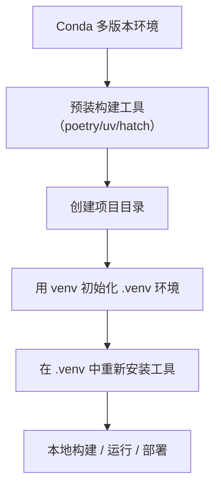

# 04 · 工具链隔离：构建工具本地化与双层隔离实践

> 本章节聚焦 Python 构建工具的隔离策略，通过“Conda 引导 + 项目 .venv 本地化”的双层架构，解决全局工具污染、版本冲突、迁移困难等问题，实现构建环境的可控与复现。

---

## 构建工具的本地化隔离原则

在 Python 项目中，`poetry`、`uv`、`hatch` 等构建工具是自动化依赖管理的核心，但“全局安装”模式常导致：  
- 多项目版本冲突  
- 路径污染与依赖混乱  
- 环境迁移后无法复现  

本节提出**双层隔离策略**，实现工具链的精准治理：  
1. **Conda 环境层**：统一预装工具，用于项目初始化与引导  
2. **项目 .venv 层**：工具本地化安装，用于实际运行与部署  

---

## 一、为什么构建工具不能全局装？

### 常见错误做法  
- 直接在系统 Python 中执行 `pip install poetry` 全局安装  
- 所有项目共享同一套工具版本  
- 项目构建依赖外部环境配置  

### 导致的问题  
- 工具版本冲突（如项目 A 需要 Poetry 1.7，项目 B 需要 1.8）  
- 迁移失败（新机器无对应工具版本，需重新配置）  
- IDE 路径混乱（VSCode/PyCharm 无法正确识别工具位置）  

---

## 二、双层治理策略设计

| 层级               | 作用                          | 工具存放路径                          |  
|--------------------|-------------------------------|---------------------------------------|  
| **Conda 环境层**   | 项目初始化与工具引导          | `I:\Conda\python312\Scripts\`         |  
| **项目 .venv 层**  | 本地运行与版本锁定            | `myproject\.venv\Scripts\`            |  


### 策略流程图  




---

## 三、实践步骤

### 1️⃣ 在 Conda 中准备构建工具  
激活目标 Conda 环境，预装基础工具（用于项目初始化）：  
```bash
conda activate python312  # 切换到目标 Python 版本环境
pip install poetry virtualenv pipenv uv hatch  # 安装工具到 Conda Python 版本基础环境
```

示例：名为 python312 的 conda 环境 工具链路径树状图：
```bash
│  │  
│  │  
│  ├─ python312 环境（Python 3.12）  
│  │  ├─ python.exe: I:\Conda\python312\python.exe  
│  │  ├─ 工具路径: I:\Conda\python312\Scripts\  
│  │  │  ├─ poetry.exe: I:\Conda\python312\Scripts\poetry.exe  
│  │  │  ├─ virtualenv.exe: I:\Conda\python312\Scripts\virtualenv.exe  
│  │  │  ├─ pipenv.exe: I:\Conda\python312\Scripts\pipenv.exe  
│  │  │  ├─ uv.exe: I:\Conda\python312\Scripts\uv.exe  
│  │  │  └─ hatch.exe: I:\Conda\python312\Scripts\hatch.exe  
│  │  ├─ PyCharm解释器路径: I:\Conda\python312\python.exe  
│  │  └─ 终端命令示例:  
│  │     ├─ poetry: "I:\Conda\python312\Scripts\poetry.exe" init  
│  │     ├─ virtualenv: "I:\Conda\python312\python.exe" -m virtualenv .venv  
│  │     ├─ pipenv: "I:\Conda\python312\Scripts\pipenv.exe" install requests  
│  │     ├─ uv: "I:\Conda\python312\Scripts\uv.exe" new .venv  
│  │     └─ hatch: "I:\Conda\python312\Scripts\hatch.exe" env create  
│  │  
│  └─
```


示例：完整的各版本python conda 环境 工具链路径树状图：
```bash
Anaconda 环境（基础路径：I:\Conda\）  
├─ base 环境（默认 Python 版本）  
│  ├─ python.exe: I:\Conda\\python.exe  
│  ├─ 工具路径: I:\Conda\\Scripts\  
│  │  ├─ poetry.exe: I:\Conda\\Scripts\poetry.exe  
│  │  ├─ virtualenv.exe: I:\Conda\\Scripts\virtualenv.exe  
│  │  ├─ pipenv.exe: I:\Conda\\Scripts\pipenv.exe  
│  │  ├─ uv.exe: I:\Conda\\Scripts\uv.exe  
│  │  └─ hatch.exe: I:\Conda\\Scripts\hatch.exe  
│  ├─ PyCharm解释器路径: I:\Conda\\python.exe  
│  └─ 终端命令示例:  
│     ├─ poetry: "I:\Conda\\Scripts\poetry.exe" init  
│     ├─ virtualenv: "I:\Conda\\python.exe" -m virtualenv .venv  
│     ├─ pipenv: "I:\Conda\\Scripts\pipenv.exe" install requests  
│     ├─ uv: "I:\Conda\\Scripts\uv.exe" new .venv  
│     └─ hatch: "I:\Conda\\Scripts\hatch.exe" env create  
│  
├─ 环境路径（I:\Conda\）  
│  ├─ python38 环境（Python 3.8）  
│  │  ├─ python.exe: I:\Conda\python38\python.exe  
│  │  ├─ 工具路径: I:\Conda\python38\Scripts\  
│  │  │  ├─ poetry.exe: I:\Conda\python38\Scripts\poetry.exe  
│  │  │  ├─ virtualenv.exe: I:\Conda\python38\Scripts\virtualenv.exe  
│  │  │  ├─ pipenv.exe: I:\Conda\python38\Scripts\pipenv.exe  
│  │  │  ├─ uv.exe: I:\Conda\python38\Scripts\uv.exe  
│  │  │  └─ hatch.exe: I:\Conda\python38\Scripts\hatch.exe  
│  │  ├─ PyCharm解释器路径: I:\Conda\python38\python.exe  
│  │  └─ 终端命令示例:  
│  │     ├─ poetry: "I:\Conda\python38\Scripts\poetry.exe" init  
│  │     ├─ virtualenv: "I:\Conda\python38\python.exe" -m virtualenv .venv  
│  │     ├─ pipenv: "I:\Conda\python38\Scripts\pipenv.exe" install requests  
│  │     ├─ uv: "I:\Conda\python38\Scripts\uv.exe" new .venv  
│  │     └─ hatch: "I:\Conda\python38\Scripts\hatch.exe" env create  
│  │  
├─ 环境路径（I:\Conda\）  
│  ├─ python39 环境（Python 3.9）  
│  │  ├─ python.exe: I:\Conda\python39\python.exe  
│  │  ├─ 工具路径: I:\Conda\python39\Scripts\  
│  │  │  ├─ poetry.exe: I:\Conda\python39\Scripts\poetry.exe  
│  │  │  ├─ virtualenv.exe: I:\Conda\python39\Scripts\virtualenv.exe  
│  │  │  ├─ pipenv.exe: I:\Conda\python39\Scripts\pipenv.exe  
│  │  │  ├─ uv.exe: I:\Conda\python39\Scripts\uv.exe  
│  │  │  └─ hatch.exe: I:\Conda\python39\Scripts\hatch.exe  
│  │  ├─ PyCharm解释器路径: I:\Conda\python39\python.exe  
│  │  └─ 终端命令示例:  
│  │     ├─ poetry: "I:\Conda\python39\Scripts\poetry.exe" init  
│  │     ├─ virtualenv: "I:\Conda\python39\python.exe" -m virtualenv .venv  
│  │     ├─ pipenv: "I:\Conda\python39\Scripts\pipenv.exe" install requests  
│  │     ├─ uv: "I:\Conda\python39\Scripts\uv.exe" new .venv  
│  │     └─ hatch: "I:\Conda\python39\Scripts\hatch.exe" env create  
│  │  
│  ├─ python310 环境（Python 3.10）  
│  │  ├─ python.exe: I:\Conda\python310\python.exe  
│  │  ├─ 工具路径: I:\Conda\python310\Scripts\  
│  │  │  ├─ poetry.exe: I:\Conda\python310\Scripts\poetry.exe  
│  │  │  ├─ virtualenv.exe: I:\Conda\python310\Scripts\virtualenv.exe  
│  │  │  ├─ pipenv.exe: I:\Conda\python310\Scripts\pipenv.exe  
│  │  │  ├─ uv.exe: I:\Conda\python310\Scripts\uv.exe  
│  │  │  └─ hatch.exe: I:\Conda\python310\Scripts\hatch.exe  
│  │  ├─ PyCharm解释器路径: I:\Conda\python310\python.exe  
│  │  └─ 终端命令示例:  
│  │     ├─ poetry: "I:\Conda\python310\Scripts\poetry.exe" init  
│  │     ├─ virtualenv: "I:\Conda\python310\python.exe" -m virtualenv .venv  
│  │     ├─ pipenv: "I:\Conda\python310\Scripts\pipenv.exe" install requests  
│  │     ├─ uv: "I:\Conda\python310\Scripts\uv.exe" new .venv  
│  │     └─ hatch: "I:\Conda\python310\Scripts\hatch.exe" env create  
│  │  
│  ├─ python311 环境（Python 3.11）  
│  │  ├─ python.exe: I:\Conda\python311\python.exe  
│  │  ├─ 工具路径: I:\Conda\python311\Scripts\  
│  │  │  ├─ poetry.exe: I:\Conda\python311\Scripts\poetry.exe  
│  │  │  ├─ virtualenv.exe: I:\Conda\python311\Scripts\virtualenv.exe  
│  │  │  ├─ pipenv.exe: I:\Conda\python311\Scripts\pipenv.exe  
│  │  │  ├─ uv.exe: I:\Conda\python311\Scripts\uv.exe  
│  │  │  └─ hatch.exe: I:\Conda\python311\Scripts\hatch.exe  
│  │  ├─ PyCharm解释器路径: I:\Conda\python311\python.exe  
│  │  └─ 终端命令示例:  
│  │     ├─ poetry: "I:\Conda\python311\Scripts\poetry.exe" init  
│  │     ├─ virtualenv: "I:\Conda\python311\python.exe" -m virtualenv .venv  
│  │     ├─ pipenv: "I:\Conda\python311\Scripts\pipenv.exe" install requests  
│  │     ├─ uv: "I:\Conda\python311\Scripts\uv.exe" new .venv  
│  │     └─ hatch: "I:\Conda\python311\Scripts\hatch.exe" env create  
│  │  
│  ├─ python312 环境（Python 3.12）  
│  │  ├─ python.exe: I:\Conda\python312\python.exe  
│  │  ├─ 工具路径: I:\Conda\python312\Scripts\  
│  │  │  ├─ poetry.exe: I:\Conda\python312\Scripts\poetry.exe  
│  │  │  ├─ virtualenv.exe: I:\Conda\python312\Scripts\virtualenv.exe  
│  │  │  ├─ pipenv.exe: I:\Conda\python312\Scripts\pipenv.exe  
│  │  │  ├─ uv.exe: I:\Conda\python312\Scripts\uv.exe  
│  │  │  └─ hatch.exe: I:\Conda\python312\Scripts\hatch.exe  
│  │  ├─ PyCharm解释器路径: I:\Conda\python312\python.exe  
│  │  └─ 终端命令示例:  
│  │     ├─ poetry: "I:\Conda\python312\Scripts\poetry.exe" init  
│  │     ├─ virtualenv: "I:\Conda\python312\python.exe" -m virtualenv .venv  
│  │     ├─ pipenv: "I:\Conda\python312\Scripts\pipenv.exe" install requests  
│  │     ├─ uv: "I:\Conda\python312\Scripts\uv.exe" new .venv  
│  │     └─ hatch: "I:\Conda\python312\Scripts\hatch.exe" env create  
│  │  
│  └─ python313 环境（Python 3.13）  
│     ├─ python.exe: I:\Conda\python313\python.exe  
│     ├─ 工具路径: I:\Conda\python313\Scripts\  
│     │  ├─ poetry.exe: I:\Conda\python313\Scripts\poetry.exe  
│     │  ├─ virtualenv.exe: I:\Conda\python313\Scripts\virtualenv.exe  
│     │  ├─ pipenv.exe: I:\Conda\python313\Scripts\pipenv.exe  
│     │  ├─ uv.exe: I:\Conda\python313\Scripts\uv.exe  
│     │  └─ hatch.exe: I:\Conda\python313\Scripts\hatch.exe  
│     ├─ PyCharm解释器路径: I:\Conda\python313\python.exe  
│     └─ 终端命令示例:  
│        ├─ poetry: "I:\Conda\python313\Scripts\poetry.exe" init  
│        ├─ virtualenv: "I:\Conda\python313\python.exe" -m virtualenv .venv  
│        ├─ pipenv: "I:\Conda\python313\Scripts\pipenv.exe" install requests  
│        ├─ uv: "I:\Conda\python313\Scripts\uv.exe" new .venv  
│        └─ hatch: "I:\Conda\python313\Scripts\hatch.exe" env create  
│  
└─ MSYS2 环境（D:\msys64\mingw64）  
   └─ Python 3.12 环境（如需）  
      ├─ python.exe: D:\msys64\mingw64\bin\python.exe  
      ├─ 工具路径: D:\msys64\mingw64\bin\  
      │  ├─ poetry.exe: D:\msys64\mingw64\bin\poetry.exe  
      │  ├─ virtualenv.exe: D:\msys64\mingw64\bin\virtualenv.exe  
      │  ├─ pipenv.exe: D:\msys64\mingw64\bin\pipenv.exe  
      │  ├─ uv.exe: D:\msys64\mingw64\bin\uv.exe  
      │  └─ hatch.exe: 暂未支持 MSYS2 环境
      ├─ PyCharm解释器路径: D:\msys64\mingw64\bin\python.exe  
      └─ 终端命令示例:  
         ├─ poetry: "D:\msys64\mingw64\bin\poetry.exe" init  
         ├─ virtualenv: "D:\msys64\mingw64\bin\python.exe" -m virtualenv .venv  
         ├─ pipenv: "D:\msys64\mingw64\bin\pipenv.exe" install requests  
         ├─ uv: "D:\msys64\mingw64\bin\uv.exe" new .venv  
         └─ hatch: "暂未支持 MSYS2 环境

```

### 2️⃣ 使用工具初始化项目  
通过 Conda 中的工具快速创建项目结构：  
```bash
# 方案 1：用 uv 创建项目（推荐）
uv venv new myproject && cd myproject

# 方案 2：用 poetry 创建项目
poetry new myproject && cd myproject
```

### 3️⃣ 在项目中创建并激活 .venv  
将工具本地化到项目目录，实现隔离：  
```bash
# 初始化项目虚拟环境
python -m venv .venv

# 激活 .venv（Windows 环境）
.\.venv\Scripts\activate

# 在 .venv 中重新安装工具（锁定版本）
pip install poetry==1.8.2 uv==0.1.37 hatch==1.9.4
```

---

## 四、路径隔离优势

1. **版本独立**：每个项目的工具版本可单独锁定，互不干扰  
2. **迁移便捷**：`.venv` 包含所有工具，复制项目即可运行，无需全局依赖  
3. **路径清晰**：IDE 可直接识别 `.venv/Scripts` 下的工具，配置零障碍  

### 项目结构示例  
```text
myproject/
├── .venv/                  # 本地化工具与依赖
│   ├── Scripts/
│   │   ├── poetry.exe      # 项目专属工具
│   │   ├── uv.exe
│   │   └── python.exe
│   └── pyvenv.cfg
├── pyproject.toml          # 依赖配置文件
└── src/                    # 项目源码
```

---

## 五、可迁移性与复现能力

### 迁移到新环境的步骤  
1. 复制项目目录到新机器  
2. 激活 .venv 环境：  
   ```bash
   cd myproject
   .\.venv\Scripts\activate
   ```  
3. 直接使用本地工具运行：  
   ```bash
   poetry install  # 或 uv sync
   ```

### 环境重建方案  
若 .venv 丢失，可通过依赖文件快速恢复：  
```bash
python -m venv .venv  # 重建虚拟环境
.\.venv\Scripts\activate
pip install -r requirements.txt  # 安装锁定的工具版本
```

---

## 六、小结

双层隔离策略通过“Conda 引导 + .venv 本地化”，实现了：  
- 工具版本的精准控制  
- 项目环境的完全自包含  
- 跨机器的无缝迁移  

这一策略是“三维治理”中“构建治理”的核心实践，为多项目并行开发提供了稳定保障。

---

### 推荐阅读  
- [三维治理理念原文](https://aicity.blog.csdn.net/article/details/149055334)  
- [Anaconda 多版本策略](./03-Anaconda多版本策略.md)  
- [路径结构规范](./02-路径结构规范.md)