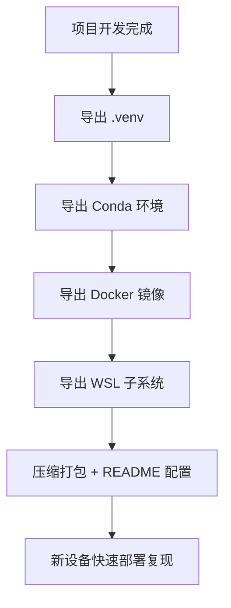

# 05 · 模板设计与迁移复现：打造可复制的 AI 项目开发结构

> 本章总结如何通过统一项目模板与环境结构，实现 `.venv`、Docker、WSL 的可迁移与复现，确保项目快速部署、教学分发、团队协作的稳定性与高效性。

---

## 🎯 核心目标

1. 统一路径结构 → 保证文件可预期定位
2. 封装环境依赖 → 保证跨平台部署一致性
3. 构建模板体系 → 快速初始化新项目
4. 支持迁移复现 → 项目可复制、可快照、可部署

---

## 📁 标准项目结构模板示例

以一个深度学习项目为例：

```text
I:\DevProjects\MyAIProject\
├── .venv\                    ← 项目专属虚拟环境（包含构建工具）
│   └── Scripts/poetry.exe    ← 项目内封装的构建工具
├── data\                     ← 原始数据或中间数据
├── models\                   ← 模型保存目录
├── notebooks\                ← Jupyter / 实验记录
├── scripts\                  ← 各类训练、推理、预处理脚本
├── README.md
├── pyproject.toml            ← 构建依赖配置（Poetry / Hatch）
├── requirements.txt
└── .env                      ← 项目环境变量配置
````

---

## ⚙ 本地开发环境组件集成

| 组件     | 示例                     | 说明                       |
| ------ | ---------------------- | ------------------------ |
| Python | 3.9 / 3.10 / 3.11      | Conda 管理，配合项目 `.venv` 创建 |
| 构建工具   | Poetry / uv / Hatch    | 安装在 `.venv` 中，版本锁定       |
| 容器工具   | Docker / Podman        | 镜像迁移 + 卷目录挂载             |
| 子系统    | WSL2 (Fedora / Ubuntu) | 可导出 `.tar` 快照进行复现        |

---

## 🧰 迁移与复现策略一览

| 对象           | 导出方式                   | 导入方式                   |
| ------------ | ---------------------- | ---------------------- |
| `.venv` 虚拟环境 | 直接复制或打包为 `.zip`        | 解压后即可使用，无需重新创建         |
| Conda 环境     | `conda env export`     | `conda env create`     |
| WSL 子系统      | `wsl --export`         | `wsl --import`         |
| Docker 镜像与卷  | `docker save` / 符号链接迁移 | `docker load` / 映射原始路径 |

---

## 🧪 示例：使用 PowerShell 快速迁移项目环境

```powershell
# 导出当前 Conda 环境列表
.\tools\export_conda_envs.ps1

# 打包当前项目（含 .venv）
Compress-Archive -Path .\* -DestinationPath ..\MyAIProject.zip

# 导出 WSL 子系统
wsl --export podman-machine-default I:\WSL_Backups\podman.tar
```

---

## 🐳 Docker 镜像与卷迁移实践

详见：[路径治理篇 · 配置 Docker 镜像与卷路径](https://aicity.blog.csdn.net/article/details/149172789)

核心操作：使用 PowerShell 符号链接静默迁移镜像路径，避免 Docker Desktop 手动修改导致异常。

```powershell
# 示例：迁移 Docker 镜像存储路径
Stop-Process -Name "Docker Desktop" -Force
Move-Item "C:\ProgramData\Docker" "I:\DockerData"
New-Item -ItemType SymbolicLink -Path "C:\ProgramData\Docker" -Target "I:\DockerData"
Start-Process "Docker Desktop"
```

---

## ✨ 项目模板初始化脚本建议

创建如 `init_project.ps1` 脚本自动生成结构：

```powershell
param(
    [string]$ProjectName = "MyNewProject"
)

$base = "I:\DevProjects\$ProjectName"
New-Item -ItemType Directory -Path $base
New-Item -ItemType Directory -Path "$base\data", "$base\models", "$base\scripts", "$base\notebooks"
python -m venv "$base\.venv"
New-Item "$base\README.md" -ItemType File
Start-Process "code" $base
```

---

## 🖼 Mermaid 图建议：开发环境快照迁移流程图



---

## 🧩 可作为教学分发模板的优势

* 新学员快速部署、零基础入门
* 项目一键构建，无需安装额外工具
* `.venv` 已含所有依赖，稳定复现
* 支持版本封装（Python、CUDA、库等）

---

## 📚 延伸阅读与参考

* [路径治理篇：打造可控、可迁移、可复现的 AI 开发路径结构](https://aicity.blog.csdn.net/article/details/149172789)
* [三维治理理念原文](https://aicity.blog.csdn.net/article/details/149055334)
* [模板部署与分发建议](https://aicity.blog.csdn.net/article/details/148982624)

---

## ✅ 总结

统一的模板结构与环境封装机制，是项目治理的重要一环：

* 保证路径结构可控
* 提升迁移部署效率
* 降低团队协作门槛
* 强化教学与演示复现能力

**治理不是约束，而是提升开发自由度的前提！**

